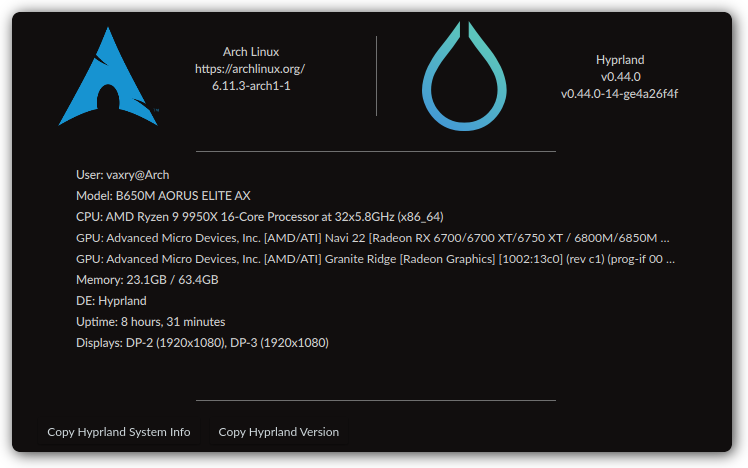

# hyprsysteminfo
A tiny qt6/qml application to display information about the running system,
or copy diagnostics data, without the terminal.

## Footnotes
[^1]:
Some distributions may not support a graphical logo in hyprsysteminfo. To check if your distribution supports a graphical logo, run `cat /etc/os-release`. If the output includes a `LOGO` line, a graphical logo should appear in hyprsysteminfo. If there is no `LOGO` line, a graphical logo will not be displayed.
